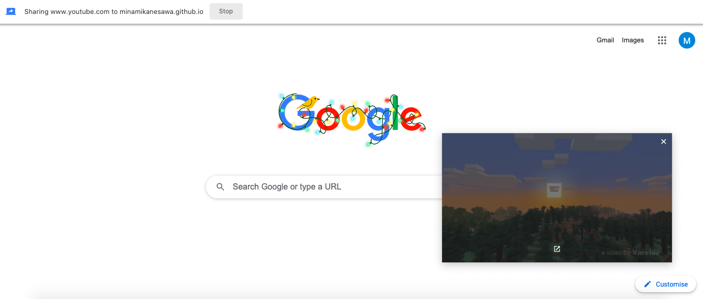

# picture-in-picture
This is the 3rd project from the course [JavaScript Web Projects: 20 Projects to Build Your Portfolio](https://academy.zerotomastery.io/p/javascript-projects).

View live [here](https://minamikanesawa.github.io/picture-in-picture/).

